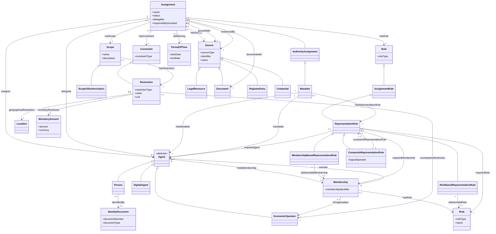

# Expert proposal: Best-compromise Full Mandate / Authorisation Model for EBWV

**Purpose.** This document proposes a best-compromise semantic model for mandates, authorisations and powers of attorney in the EU Business Wallet Vocabulary (EBWV) context. It reconciles three modelling needs:

1. the original PlantUML “Full Mandate” / general authorisation model;
2. the existing EBWV Vocabulary, which already contains useful but incomplete authorisation-related building blocks; and
3. the Nordic Core Business Vocabulary (NCBV), which already contains a mature mandate and representation-rule pattern.

The proposal deliberately avoids modelling only a narrow “power of attorney” document. Instead, it treats a mandate as a specialised form of a more generic **authority assignment**. This makes the model usable for legal mandates, representation rights, digital wallet authorisations, delegated business responsibilities, e-service permissions and future agentic AI use cases.

---

## 1. Core modelling decision

The recommended compromise is:

> Model a mandate as a specialised **authority assignment**, not merely as a document and not only as a bilateral relation between two persons.

The top-level semantic pattern is therefore:

```text
Assignment
  └── AuthorityAssignment
        └── Mandate
```

This allows EBWV to support broader use cases while remaining compatible with NCBV’s mandate-specific model.

### Why this compromise is preferable

| Requirement | Modelling consequence |
|---|---|
| Reuse EBWV generically across business wallet use cases | Use `Assignment` and `AuthorityAssignment` as generic upper classes. |
| Preserve Nordic mandate terminology | Include `Mandate`, `Mandator`, `Mandatee`, `RepresentationRule`, `Membership`, `Scope`, `Restriction`, `Source`. |
| Support powers of attorney and legal representation | Model source, scope, restrictions, representation rules and validity period explicitly. |
| Support digital and AI-agent delegation | Include `DigitalAgent` as a subclass of `Agent`. |
| Avoid document-centric modelling | Treat `Document` as evidence/source, not as the mandate itself. |
| Support joint signing and collective authority | Use `RepresentationRule` and `CompositeRepresentationRule`. |
| Support profiles and constraints in SHACL | Keep OWL generic; put cardinalities, datatypes and code-list requirements in SHACL. |

---

## 2. Mermaid chart



---

## 3. Step-by-step explanation of the model

## Step 1 — `Agent`: the generic actor

### Included class

```text
Agent
```

`Agent` is the generic superclass for anything that can hold a role, grant authority, receive authority, act on behalf of another party, or participate in a rule.

### Main subclasses

| Class | Meaning |
|---|---|
| `Person` | A natural person. |
| `EconomicOperator` | A company, legal entity, sole trader, public body or other business-wallet-relevant operator. |
| `DigitalAgent` | A software system, wallet component, API, automated service, AI agent or other digital actor. |

### Reasoning

The original PlantUML model used `Person`, `EconomicOperator` and `Machine`. The compromise model replaces `Machine` with `DigitalAgent`, because “machine” is too narrow and too hardware-oriented. `DigitalAgent` better supports future wallet automation and agentic AI use cases.

---

## Step 2 — `Assignment`: the generic allocation pattern

### Included class

```text
Assignment
```

`Assignment` is the broadest class in the model. It represents the formal allocation of a role, responsibility, task, right, permission, entitlement, duty, capacity or authority.

### Core properties

| Property | Range | Meaning |
|---|---|---|
| `assignor` | `Agent` | The party that allocates, grants or establishes the assignment. |
| `assignee` | `Agent` | The party that receives or is subject to the assignment. |
| `name` | literal | Human-readable name of the assignment. |
| `status` | controlled value / SKOS concept | Lifecycle status, such as active, inactive, revoked, expired or suspended. |
| `delegable` | boolean | Whether the assignment can be delegated further. |
| `responsibilityIncluded` | boolean | Whether the assignment includes responsibility or merely authority/capacity to act. |

### Reasoning

This is the key generic EBWV layer. It prevents the vocabulary from becoming mandate-only. Many EBW use cases can be described as assignments even when they are not legal mandates.

Examples:

- a person is assigned the right to submit a VAT declaration;
- an accounting service provider is assigned reporting responsibility;
- a digital agent is assigned permission to present credentials;
- an employee is assigned a role in a company process;
- a representative is assigned authority to sign a contract.

---

## Step 3 — `AuthorityAssignment`: the general authorisation layer

### Included class

```text
AuthorityAssignment
```

`AuthorityAssignment` is a subclass of `Assignment`. It covers assignments that grant authority, capacity, competence or permission to act.

### Why this class is needed

Not all assignments grant authority. Some assignments are merely tasks, duties or responsibilities. A mandate or power of attorney, however, normally grants authority to act within a defined scope.

### Typical examples

- representation right;
- signing authority;
- e-service authorisation;
- power of attorney;
- authorisation to submit declarations;
- delegation to an AI or software agent;
- authority to access or present wallet-held credentials.

---

## Step 4 — `Mandate`: the Nordic-aligned specialisation

### Included class

```text
Mandate
```

`Mandate` is a subclass of `AuthorityAssignment`. It is the mandate-specific class aligned with the Nordic Core Business Vocabulary.

### Mandate-specific properties

| Property | Generic parent | Meaning |
|---|---|---|
| `hasMandator` | subproperty of `assignor` | The original party granting the delegated power. |
| `mandatee` | subproperty of `assignee` | The party receiving the mandate. |
| `hasRepresentationRule` | subproperty of `hasRule` | The rule that determines who may exercise the mandate or representation right. |

### Reasoning

NCBV already uses mandate-specific terminology. The compromise model keeps this terminology, but places it under the more generic EBWV pattern:

```text
Assignment → AuthorityAssignment → Mandate
```

This allows exact mandate modelling without forcing all authorisation-like use cases to be called mandates.

---

## Step 5 — `Membership`: the organisational role relation

### Included class

```text
Membership
```

`Membership` represents a contextual relationship where an agent holds a role in relation to an organisation or another agent.

### Properties

| Property | Range | Meaning |
|---|---|---|
| `member` | `Agent` | The person, organisation or digital agent holding the membership or role. |
| `inOrganisation` | `EconomicOperator` | The organisation in which the role is held. |
| `hasRole` | `Role` | The role held by the member. |
| `membershipIdentifier` | identifier | Optional identifier for the membership relationship. |

### Reasoning

The PlantUML model used `Membership` for grantor, grantee and witness relations. NCBV also uses `Membership` and aligns it with the W3C Organization Ontology. Therefore, the compromise model keeps `Membership` instead of replacing it with `AgentRole` as the main label.

However, semantically, `Membership` should be understood broadly enough to cover role-holding relationships such as:

- CEO;
- board member;
- employee;
- legal representative;
- accountant;
- wallet administrator;
- local unit manager;
- machine or software agent operating under an organisational role.

---

## Step 6 — `Role`: reusable role type

### Included class

```text
Role
```

`Role` describes the function, capacity or position held by an agent in a membership or representation context.

### Properties

| Property | Meaning |
|---|---|
| `roleType` | Controlled role concept. |
| `name` | Human-readable role name. |

### Examples

- CEO;
- board member;
- authorised signatory;
- accountant;
- customs representative;
- tax representative;
- service administrator;
- digital wallet operator.

### Reasoning

Roles should not be represented only as free-text strings. A class-based `Role` pattern allows code lists, multilingual terminology and cross-border semantic mapping.

---

## Step 7 — `Rule`: generic rule layer

### Included classes

```text
Rule
AssignmentRule
RepresentationRule
RoleBasedRepresentationRule
MembershipBasedRepresentationRule
CompositeRepresentationRule
```

### Class hierarchy

```text
Rule
  └── AssignmentRule
        └── RepresentationRule
              ├── RoleBasedRepresentationRule
              ├── MembershipBasedRepresentationRule
              └── CompositeRepresentationRule
```

### Reasoning

The PlantUML model had `AssignmentRule` with values such as:

- alone;
- all;
- majority;
- one of y;
- at least x of y.

NCBV has a more developed representation-rule pattern. The compromise model therefore keeps a generic `AssignmentRule`, but uses NCBV-compatible `RepresentationRule` classes for mandate and signatory-right cases.

### Properties

| Property | Range | Meaning |
|---|---|---|
| `hasRule` | `Rule` | Generic relation from an assignment to a rule. |
| `hasRepresentationRule` | `RepresentationRule` | Mandate-specific rule relation. |
| `consistsOfRepresentationRule` | `RepresentationRule` | Used by composite rules. |
| `definesValidRole` | `Role` | A rule based on valid role holders. |
| `definesValidMembership` | `Membership` | A rule based on specific memberships. |
| `requiredAgent` | `Agent` | A rule based on named agents. |
| `logicalOperator` | controlled value | How sub-rules are combined, e.g. AND, OR, threshold, majority. |

### Example

A company rule such as:

```text
CEO alone OR two board members jointly
```

can be represented as a `CompositeRepresentationRule` consisting of:

1. one `RoleBasedRepresentationRule` for CEO alone; and
2. another `RoleBasedRepresentationRule` requiring two board members.

---

## Step 8 — `Scope`: what the authority covers

### Included classes

```text
Scope
ScopeOfAuthorization
```

`Scope` describes the actions, matters, transactions, resources, services, locations, sectors, purposes or circumstances covered by an assignment or mandate.

`ScopeOfAuthorization` is a narrower subclass for authorisation-specific use cases.

### Properties

| Property | Range | Meaning |
|---|---|---|
| `hasScope` | `Scope` | Connects an assignment to its scope. |
| `name` | literal | Human-readable scope name. |
| `description` | literal | Further explanation of the scope. |
| `hasRestriction` | `Restriction` | Restrictions that limit the scope. |

### Examples of scope

- submit VAT returns;
- sign contracts;
- buy goods;
- sell products;
- access a public e-service;
- present a specific credential;
- represent the company in customs matters;
- operate only in a specific country or region.

### Reasoning

The existing EBWV `ScopeOfAuthorization` is useful but too narrow as the general concept. NCBV uses `Scope`. Therefore the compromise is:

```text
Scope
  └── ScopeOfAuthorization
```

---

## Step 9 — `Constraint` and `Restriction`: limitations and conditions

### Included classes

```text
Constraint
Restriction
```

`Constraint` is the generic upper class. `Restriction` is the mandate- and authorisation-facing subclass aligned with NCBV.

### Properties

| Property | Range | Meaning |
|---|---|---|
| `hasConstraint` | `Constraint` | Generic relation from assignment, scope or process to a constraint. |
| `hasRestriction` | `Restriction` | Restriction-specific relation, especially for mandates. |
| `restrictionType` | controlled value | Type of restriction. |
| `value` | literal / structured value | Restriction value. |
| `unit` | controlled value | Unit of the restriction value. |
| `geographicalRestriction` | `Location` | Geographic limitation. |
| `monetaryRestriction` | `MonetaryAmount` | Financial limitation. |
| `counterpartyRestriction` | `EconomicOperator` | Restriction to a specific counterparty. |

### Examples of restrictions

- maximum value EUR 10,000;
- only in Finland;
- only for NACE sector C16;
- only for customs declarations;
- no right to further delegate;
- only once per calendar month;
- only through a specific e-service;
- only for transactions with a specific counterparty.

### Reasoning

The PlantUML model used `Restriction`, and NCBV also uses `Restriction`. The term is good for mandate-specific modelling. But EBWV should also support more generic constraints, so the model includes both:

```text
Constraint
  └── Restriction
```

---

## Step 10 — `PeriodOfTime`: validity period

### Included class

```text
PeriodOfTime
```

### Properties

| Property | Meaning |
|---|---|
| `startDate` | Start of validity. |
| `endDate` | End of validity. |
| `validDuring` | Assignment is valid during this period. |
| `hasDuration` | Generic duration relation, aligned with NCBV. |

### Recommendation

Use both property levels:

```text
hasDuration
  └── validDuring
```

`hasDuration` aligns with NCBV. `validDuring` is semantically clearer for EBWV credentials and authorisations.

---

## Step 11 — `Source`: basis and evidence

### Included classes

```text
Source
  ├── LegalResource
  ├── Document
  ├── RegisterEntry
  └── Credential
```

`Source` describes what the assignment, mandate or authority is based on or evidenced by.

### Properties

| Property | Range | Meaning |
|---|---|---|
| `hasSource` | `Source` | General source relation, aligned with NCBV. |
| `groundedIn` | `Source` | The legal, contractual, organisational or administrative basis. |
| `evidencedBy` | `Source` | A source that proves or supports the assertion. |
| `documentedIn` | `Document` | A document where the assignment or mandate is recorded. |

### Difference between the properties

| Property | Example |
|---|---|
| `groundedIn` | Company law, articles of association, statute, original mandate. |
| `evidencedBy` | Register entry, credential, public record, signed attestation. |
| `documentedIn` | PDF power of attorney, board decision document, contract. |
| `hasSource` | Generic NCBV-aligned source relation when no finer distinction is needed. |

### Reasoning

The original PlantUML class `Law` is too narrow. NCBV uses `Source`, `LegalResource` and `Document`. The compromise follows NCBV and uses `Source` as the general class. `LegalResource` and `Document` are subclasses.

---

## Step 12 — `IdentityDocument`: identity evidence

### Included class

```text
IdentityDocument
```

### Properties

| Property | Meaning |
|---|---|
| `documentNumber` | Identifier of the identity document. |
| `documentType` | Controlled type such as passport, identity card or residence permit. |

### Reasoning

The PlantUML model includes `IdentificationDocument`. Neither EBWV nor NCBV appears to fully cover this as a generic class. It is useful across many EBW use cases, including KYC, identity matching, representation, onboarding and cross-border authority verification.

---

## Step 13 — `Location` and `MonetaryAmount`: reusable restriction targets

### Included classes

```text
Location
MonetaryAmount
```

These are not mandate-specific classes. They are reusable EBWV building blocks that can be used inside restrictions.

### Examples

| Restriction type | Modelled with |
|---|---|
| Geographic limit | `Location` |
| Maximum transaction value | `MonetaryAmount` |
| Counterparty limitation | `EconomicOperator` |
| Sector limitation | SKOS concept, e.g. NACE concept |
| E-service limitation | SKOS concept, e.g. e-service/action concept |

---

## 4. Recommended controlled vocabularies

The compromise model should not represent code lists as OWL classes such as `CodeList:NACE` or `CodeList:eService`. These should be represented as SKOS concept schemes in EBWV Terminology.

Recommended concept schemes:

| Concept scheme | Example concepts |
|---|---|
| `AssignmentStatusScheme` | active, inactive, revoked, expired, suspended |
| `AssignmentRuleTypeScheme` | alone, all, majority, one-of-many, at-least-x-of-y |
| `LogicalOperatorScheme` | AND, OR, threshold, majority |
| `RestrictionTypeScheme` | monetary, geographic, sectoral, counterparty, frequency, service, purpose |
| `RoleTypeScheme` | CEO, board member, authorised signatory, accountant, representative |
| `IdentityDocumentTypeScheme` | passport, identity card, residence permit |
| `ActionOrServiceScopeScheme` | buy, sell, pay, issue, decide, submit, access, represent |
| `CurrencyScheme` | EUR, SEK, NOK, USD |
| `NACEScheme` | NACE activity concepts |
| `RegionTypeScheme` | state, province, municipality |

---

## 5. Recommended property naming compromise

| Concept | Generic EBWV property | Mandate / NCBV-aligned property | Recommendation |
|---|---|---|---|
| Granting party | `assignor` | `hasMandator` | Use `assignor` generally; `hasMandator` for mandates. |
| Receiving party | `assignee` | `mandatee` | Use `assignee` generally; `mandatee` for mandates. |
| Scope | `hasScope` | `hasScope` | Use `hasScope`. |
| Rule | `hasRule` | `hasRepresentationRule` | Use `hasRule` generally; `hasRepresentationRule` for mandate/signatory cases. |
| Restriction | `hasConstraint` | `hasRestriction` | Use `hasConstraint` generally; `hasRestriction` under scope/mandate profiles. |
| Duration | `hasDuration` | `hasDuration` | Use as generic period relation. |
| Validity period | `validDuring` | — | Use as a clearer subproperty of `hasDuration`. |
| Source | `hasSource` | `hasSource` | Use for NCBV alignment. |
| Legal basis | `groundedIn` | source relation | Use for legal/organisational basis. |
| Evidence | `evidencedBy` | source/document relation | Use for proof or supporting evidence. |
| Documentation | `documentedIn` | `Document` | Use when specifically documented in a document. |
| Delegability | `delegable` | `delegable` | Use `delegable`. |
| Status | `status` | `status` | Use controlled vocabulary values. |

---

## 6. Recommended OWL-level structure

The following high-level subclass structure is recommended for EBWV:

```text
Agent
  ├── Person
  ├── EconomicOperator
  └── DigitalAgent

Assignment
  └── AuthorityAssignment
        └── Mandate

Membership
Role

Rule
  └── AssignmentRule
        └── RepresentationRule
              ├── RoleBasedRepresentationRule
              ├── MembershipBasedRepresentationRule
              └── CompositeRepresentationRule

Scope
  └── ScopeOfAuthorization

Constraint
  └── Restriction

Source
  ├── LegalResource
  ├── Document
  ├── RegisterEntry
  └── Credential
```

---

## 7. Recommended SHACL-level constraints

OWL should remain generic. Specific mandate profiles should define detailed requirements in SHACL.

For a full mandate attestation profile, likely SHACL constraints include:

| Class | Required properties in mandate profile |
|---|---|
| `Mandate` | `hasMandator`, `mandatee`, `hasScope`, `hasRepresentationRule`, `validDuring`, `status` |
| `Scope` | `name`; optionally `hasRestriction` |
| `RepresentationRule` | one of `requiredAgent`, `requiredRole`, `requiredMembership`, or `consistsOfRepresentationRule` |
| `CompositeRepresentationRule` | `consistsOfRepresentationRule`, `logicalOperator` |
| `Restriction` | `restrictionType`; at least one value-bearing property |
| `Membership` | `member`, `inOrganisation`, `hasRole` |
| `PeriodOfTime` | `startDate`; optionally `endDate` |
| `Source` | `sourceType`, `identifier` or `name` |

This separation is important: OWL defines the semantic meaning; SHACL defines profile-specific data requirements, cardinalities and datatypes.

---

## 8. Practical examples

### Example 1 — Simple power of attorney

```text
Mandator: Company A
Mandatee: Person B
Scope: Sign one purchase contract
Restriction: Maximum value EUR 50,000
Validity: 2026-01-01 to 2026-12-31
Source: Signed power of attorney document
Rule: Person B alone
```

### Example 2 — Company legal representation

```text
Mandator: Company A
Mandatee: role holders defined by representation rule
Scope: General signatory authority
Rule: CEO alone OR two board members jointly
Source: Company register entry and company law
Validity: Until revoked or until role membership changes
```

### Example 3 — Digital-agent authorisation

```text
Assignor: Company A
Assignee: DigitalAgent X
Scope: Present VAT registration credential to selected public e-services
Restriction: Only for services in Finland; no further delegation
Source: Wallet administration policy and explicit business authorisation
Validity: 90 days
```

This third example demonstrates why EBWV needs the generic `Assignment` / `AuthorityAssignment` layer and should not model everything only as `Mandate`.

---

## 9. Final expert recommendation

The best compromise model is not the original PlantUML model as-is, and not a pure copy of NCBV. The recommended EBWV-compatible model is:

1. Use **`Assignment`** as the generic parent for allocated rights, duties, tasks, permissions, roles and responsibilities.
2. Use **`AuthorityAssignment`** for cases where the assignment grants authority or permission to act.
3. Use **`Mandate`** as the NCBV-aligned legal/representation specialisation of `AuthorityAssignment`.
4. Use **`Membership`** and **`Role`** for organisational role-based representation.
5. Use **`RepresentationRule`** and **`CompositeRepresentationRule`** for legal representation and signatory-rule logic.
6. Use **`Scope`** as the generic scope class, with `ScopeOfAuthorization` as a narrower subclass.
7. Use **`Constraint`** as the generic upper class and **`Restriction`** as the mandate-facing subclass.
8. Use **`Source`** as the general basis/evidence class, with `LegalResource`, `Document`, `RegisterEntry` and `Credential` as subclasses.
9. Add **`DigitalAgent`** because EBW authorisations will increasingly be exercised by software, APIs, wallet components and AI agents.
10. Keep OWL generic and move profile-specific mandatory fields, cardinalities, datatypes and code-list restrictions to SHACL.

The result is a model that is legally meaningful, compatible with Nordic terminology, suitable for EBWV, and reusable for future wallet-based automation.
