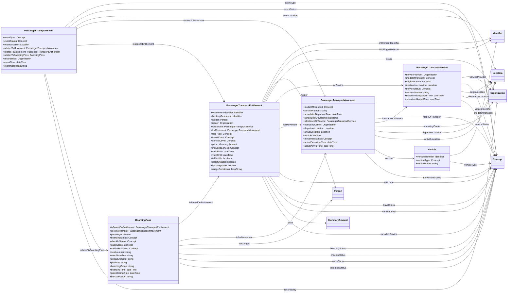

# European Business Wallet Passenger Transport Vocabulary v0.1

Vocabulary for person transport entitlement, service, movement, boarding pass and transport event data in verifiable credentials and wallet-based transport use cases.

This Markdown file is ready for GitHub publication and contains a Mermaid class diagram generated from the YAML vocabulary.

## Mermaid class diagram

## Classes included

- `PassengerTransportEntitlement` — Passenger Transport Entitlement
- `PassengerTransportService` — Passenger Transport Service
- `PassengerTransportMovement` — Passenger Transport Movement
- `BoardingPass` — Boarding Pass
- `PassengerTransportEvent` — Passenger Transport Event
- `Vehicle` — Vehicle

## Property summary

### `PassengerTransportEntitlement`

- `entitlementIdentifier` → `ebwv:Identifier`
- `bookingReference` → `ebwv:Identifier`
- `holder` → `ebwv:Person`
- `issuer` → `org:Organization`
- `forService` → `PassengerTransportService`
- `forMovement` → `PassengerTransportMovement`
- `fareType` → `skos:Concept`
- `travelClass` → `skos:Concept`
- `serviceLevel` → `skos:Concept`
- `price` → `ebwv:MonetaryAmount`
- `includedService` → `skos:Concept`
- `validFrom` → `xsd:dateTime`
- `validUntil` → `xsd:dateTime`
- `isFlexible` → `xsd:boolean`
- `isRefundable` → `xsd:boolean`
- `isChangeable` → `xsd:boolean`
- `usageConditions` → `rdf:langString`

### `PassengerTransportService`

- `serviceProvider` → `org:Organization`
- `modeOfTransport` → `skos:Concept`
- `originLocation` → `ebwv:Location`
- `destinationLocation` → `ebwv:Location`
- `serviceStatus` → `skos:Concept`
- `serviceNumber` → `xsd:string`
- `scheduledDepartureTime` → `xsd:dateTime`
- `scheduledArrivalTime` → `xsd:dateTime`

### `PassengerTransportMovement`

- `modeOfTransport` → `skos:Concept`
- `serviceNumber` → `xsd:string`
- `scheduledDepartureTime` → `xsd:dateTime`
- `scheduledArrivalTime` → `xsd:dateTime`
- `isInstanceOfService` → `PassengerTransportService`
- `operatingCarrier` → `org:Organization`
- `departureLocation` → `ebwv:Location`
- `arrivalLocation` → `ebwv:Location`
- `vehicle` → `Vehicle`
- `movementStatus` → `skos:Concept`
- `actualDepartureTime` → `xsd:dateTime`
- `actualArrivalTime` → `xsd:dateTime`

### `BoardingPass`

- `isBasedOnEntitlement` → `PassengerTransportEntitlement`
- `isForMovement` → `PassengerTransportMovement`
- `passenger` → `ebwv:Person`
- `boardingStatus` → `skos:Concept`
- `checkInStatus` → `skos:Concept`
- `cabinClass` → `skos:Concept`
- `validationStatus` → `skos:Concept`
- `seatNumber` → `xsd:string`
- `coachNumber` → `xsd:string`
- `departureGate` → `xsd:string`
- `platform` → `xsd:string`
- `boardingGroup` → `xsd:string`
- `boardingTime` → `xsd:dateTime`
- `gateClosingTime` → `xsd:dateTime`
- `barcodeValue` → `xsd:string`

### `PassengerTransportEvent`

- `eventType` → `skos:Concept`
- `eventStatus` → `skos:Concept`
- `eventLocation` → `ebwv:Location`
- `relatesToMovement` → `PassengerTransportMovement`
- `relatesToEntitlement` → `PassengerTransportEntitlement`
- `relatesToBoardingPass` → `BoardingPass`
- `recordedBy` → `org:Organization`
- `eventTime` → `xsd:dateTime`
- `eventNote` → `rdf:langString`

### `Vehicle`

- `vehicleIdentifier` → `ebwv:Identifier`
- `vehicleType` → `skos:Concept`
- `vehicleName` → `xsd:string`
