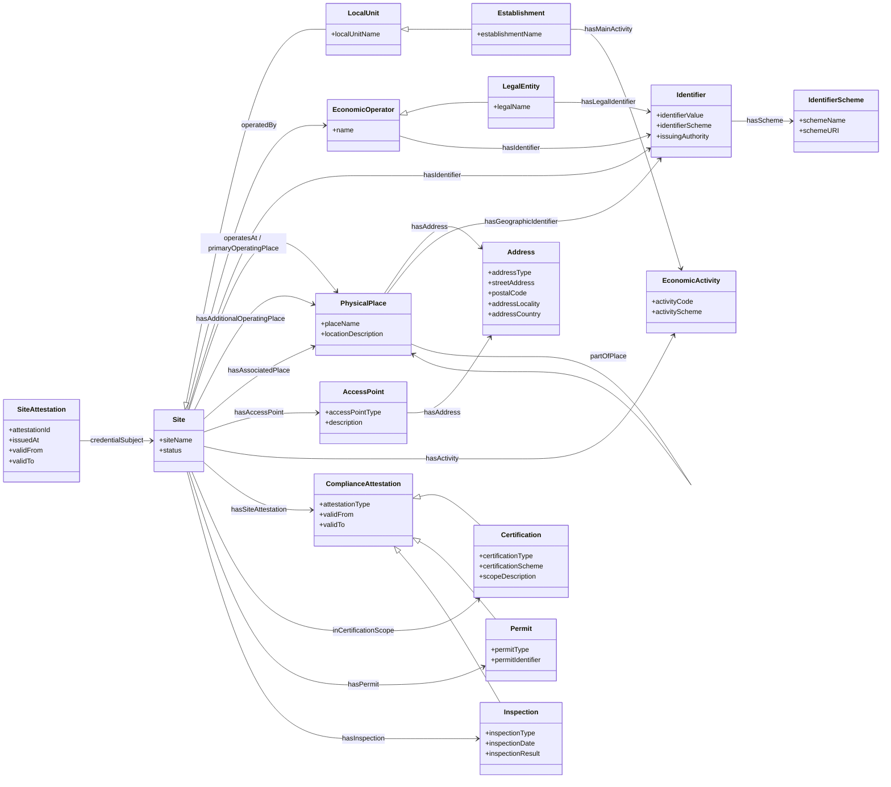
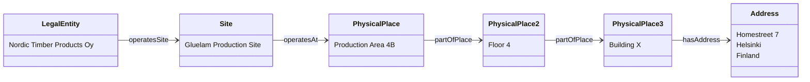

# Site Attestation Data Model

## Non-expert friendly explanation of the proposed semantic model

**Purpose of this document**

This document explains a proposed data model for a **Site Attestation**. The model is intended for situations where a business, public authority, certification body, or digital wallet needs to state reliable facts about a specific business site.

A **site** is not just an address. In this model, a site means an **operational business unit** that works at, or from, a specific physical place. For example, a site could be:

- a factory;
- a warehouse;
- a shop;
- a laboratory;
- a construction site;
- a production area inside a building;
- floor 4 of Building X at Homestreet 7;
- a rented facility used by a company.

The model distinguishes carefully between:

- **who** operates the site;
- **what** the site is called and how it is identified;
- **where** the site is physically located;
- **what activity** is carried out at the site;
- **which certifications, permits or inspections** apply to the site.

This distinction is important because a legal entity may have many sites, and site-specific facts should not be confused with company-wide facts.

---

## 1. Basic idea

The Site Attestation model answers questions such as:

| Question | Answered by |
|---|---|
| Who is legally responsible for the site? | `operatedBy` linking the Site to an Economic Operator or Legal Entity |
| What is the site called? | `siteName` |
| How is the site identified? | `hasIdentifier` |
| Where is the site located? | `operatesAt` linking the Site to a Physical Place |
| What is the postal or visiting address? | `hasAddress` on the Physical Place |
| Is the site inside a building, floor, room or parcel? | `partOfPlace` |
| What business activity is performed there? | `hasActivity` or `hasMainActivity` |
| Which compliance evidence applies to this site? | `hasSiteAttestation`, `hasPermit`, `hasInspection`, `inCertificationScope` |

The central rule is:

```text
A Site should not be modeled simply as an address.
A Site should be modeled as an operational unit that operates at a Physical Place.
```

---

## 2. Mermaid overview of the data model



---

## 3. Main classes explained

### 3.1 SiteAttestation

A **SiteAttestation** is the digital statement or credential that contains verified information about a site.

It is not the site itself. It is the evidence or attestation about the site.

Example:

```text
A chamber of commerce, public authority, certification body or wallet issuer may issue a Site Attestation stating that Nordic Timber Products Oy operates the Gluelam Production Site at Building X, floor 4, Homestreet 7.
```

Typical information in a SiteAttestation:

| Attribute | Meaning |
|---|---|
| `attestationId` | Identifier of the attestation itself |
| `issuedAt` | When the attestation was issued |
| `validFrom` | Start date of validity |
| `validTo` | End date of validity |
| `credentialSubject` | The site that the attestation describes |

---

### 3.2 Site

A **Site** is the core subject of the model.

A site is an **operational business unit** that carries out one or more business functions or activities at, or from, a specific physical place.

Examples:

- a production site;
- a warehouse site;
- a customer service office;
- a retail shop;
- a laboratory;
- a construction work site;
- a rented building used for operations;
- a specific floor or unit inside a larger building.

A site should have a persistent identity that does not depend only on its address. This is important because an address can change while the site remains the same.

Example:

```text
If a street is renamed, the site should not automatically become a new site.
```

Recommended site information:

| Attribute | Meaning |
|---|---|
| `siteName` | Human-readable name of the site |
| `status` | Operational status, for example active, inactive or closed |
| `hasIdentifier` | One or more identifiers for the site |
| `operatedBy` | The economic operator or legal entity responsible for the site |
| `operatesAt` | The physical place where the site operates |
| `hasActivity` | Business activities carried out at the site |

---

### 3.3 LocalUnit

A **LocalUnit** is a geographically identified part of an enterprise or economic operator where economic activity is carried out.

This is often a statistical or business-register concept.

Examples:

- a company’s Helsinki office;
- a factory located in a specific municipality;
- a warehouse recorded in a business register;
- a regional branch office.

In this model, `LocalUnit` is shown as a more formal or register-oriented subtype of `Site`.

This means:

```text
Every LocalUnit can be treated as a Site for this model,
but not every Site needs to be a formally registered LocalUnit.
```

For example, “floor 4 of Building X” may be a site, but it may not be separately recorded as a local unit in a business register.

---

### 3.4 Establishment

An **Establishment** is a location-specific business unit characterized by a particular economic activity.

It answers the question:

```text
What kind of economic activity is carried out at this location?
```

Examples:

- a manufacturing establishment;
- a restaurant establishment;
- a retail establishment;
- a gluelam production establishment;
- a logistics establishment.

In this model, `Establishment` is shown as a subtype of `LocalUnit` because it combines:

1. a business unit;
2. a location;
3. a specific business activity.

This is especially useful when the model needs to link a site to an activity classification such as NACE or ISIC.

---

### 3.5 EconomicOperator

An **EconomicOperator** is the business actor responsible for carrying out economic activity.

This may be:

- a company;
- a sole trader;
- a public body acting in an economic role;
- another organization participating in business processes.

In the Site Attestation model, the Economic Operator is the actor that operates the site.

Example:

```text
Nordic Timber Products Oy operates the Gluelam Production Site.
```

This relationship is expressed with the object property:

```text
Site -- operatedBy --> EconomicOperator
```

---

### 3.6 LegalEntity

A **LegalEntity** is an entity recognized by law, such as a registered company.

It is modeled as a subtype of `EconomicOperator`, because many economic operators are legal entities. However, not all economic operators must necessarily be legal entities. For example, a sole trader may be an economic operator even if the legal form differs from a registered company.

Typical legal entity identifiers include:

- LEI;
- EUID;
- national business registration number;
- D-U-N-S number;
- GLN if used as a party identifier.

Important distinction:

```text
LEI and EUID identify the legal entity.
They do not identify the site itself.
```

---

### 3.7 PhysicalPlace

A **PhysicalPlace** is the physical location where a site operates.

This is deliberately separated from the site itself.

Example:

```text
Site: Gluelam Production Site
PhysicalPlace: Production area 4B on floor 4 of Building X
Address: Homestreet 7, Helsinki, Finland
```

The site is the operational unit. The physical place is where the operational unit is located.

A PhysicalPlace may be described through:

- an address;
- a building identifier;
- a floor;
- a room or unit;
- a land parcel;
- coordinates;
- a polygon or boundary;
- a human-readable location description.

---

### 3.8 Address

An **Address** is the structured address of a physical place.

Typical address fields:

| Attribute | Meaning |
|---|---|
| `addressType` | Type of address, for example visiting address, postal address, registered address or entrance address |
| `streetAddress` | Street name and number |
| `postalCode` | Postal code |
| `addressLocality` | City, town or locality |
| `addressCountry` | Country |

An address should usually be attached to the `PhysicalPlace`, not directly to the `Site`.

Recommended pattern:

```text
Site -- operatesAt --> PhysicalPlace -- hasAddress --> Address
```

This allows multiple sites to exist at the same address.

---

### 3.9 AccessPoint

An **AccessPoint** is a specific entry, gate, door, loading bay, reception point or other access location associated with a site.

This is needed because “additional addresses” may sometimes actually mean additional entrances or access points, not separate sites.

Examples:

- main entrance;
- goods receiving gate;
- loading dock 3;
- visitor entrance;
- emergency access point;
- scanner point in a logistics process.

An AccessPoint can have its own address or location description.

Recommended use:

```text
Site -- hasAccessPoint --> AccessPoint
AccessPoint -- hasAddress --> Address
```

---

### 3.10 Identifier

An **Identifier** is a structured way to represent any identifier assigned to a site, legal entity, physical place or other object.

Instead of creating separate fields for every identifier type, the model uses a generic identifier structure.

Examples of identifier schemes:

- GLN;
- D-U-N-S;
- SIRET;
- LEI;
- EUID;
- national business register number;
- internal site ID;
- issuer-generated UUID;
- cadastral parcel identifier;
- building identifier.

Recommended identifier structure:

| Attribute | Meaning |
|---|---|
| `identifierValue` | The actual identifier value |
| `identifierScheme` | The scheme used, for example GLN, LEI or SIRET |
| `issuingAuthority` | The authority or organization responsible for the identifier |

This avoids having many separate properties such as:

```text
gln_site_number
duns_site_number
siret_site_number
operating_legal_entity_LEI
operating_legal_entity_EUID
```

Instead, all of these can be represented as identifiers with different schemes.

---

### 3.11 IdentifierScheme

An **IdentifierScheme** describes what kind of identifier is being used.

Examples:

| Identifier scheme | Usually identifies |
|---|---|
| GLN | A party, function, physical location, digital location or site, depending on use |
| LEI | A legal entity |
| EUID | A legal entity in the EU/BRIS context |
| D-U-N-S | A business entity, branch or location record depending on use |
| SIRET | An establishment or local unit in the French context |
| UUID | A globally unique technical identifier |

The same identifier scheme can sometimes be used for different kinds of things. For example, GLN can identify a legal entity, a function or a physical location. Therefore, the model must always show **which object the identifier is attached to**.

---

### 3.12 EconomicActivity

An **EconomicActivity** describes the business activity carried out at a site or establishment.

Examples:

- manufacturing;
- warehousing;
- retail trade;
- restaurant services;
- logistics;
- research and development;
- customer support.

The activity should usually be expressed using a recognized classification scheme, such as:

- NACE in the European context;
- ISIC in international contexts;
- national industry classifications where relevant.

Example:

```text
Site -- hasActivity --> Manufacture of wood products
Establishment -- hasMainActivity --> Manufacture of gluelam products
```

---

### 3.13 ComplianceAttestation

A **ComplianceAttestation** is a generic class for site-related evidence, certificates, approvals, permits or inspections.

It is used when a statement applies to the site.

Examples:

- ISO certification;
- environmental permit;
- customs warehouse authorization;
- safety inspection;
- food safety approval;
- ESG audit;
- regulatory approval.

The model includes three important subtypes:

| Class | Meaning |
|---|---|
| `Certification` | A certificate or certification applying to the site |
| `Permit` | A permission, license or authorization granted to the site or operator |
| `Inspection` | A control, audit or inspection event concerning the site |

---

## 4. Object properties explained

Object properties describe relationships between classes.

For example:

```text
Site -- operatedBy --> EconomicOperator
```

means that a site is operated by an economic operator.

---

### 4.1 credentialSubject

```text
SiteAttestation -- credentialSubject --> Site
```

This property links the attestation to the site that the attestation describes.

Plain-language explanation:

```text
This attestation is about this site.
```

Example:

```text
The Site Attestation is about the Gluelam Production Site.
```

---

### 4.2 operatedBy

```text
Site -- operatedBy --> EconomicOperator
```

This property links a site to the economic operator legally or operationally responsible for it.

Plain-language explanation:

```text
This site is operated by this company or organization.
```

Example:

```text
The Gluelam Production Site is operated by Nordic Timber Products Oy.
```

This is one of the most important properties in the model.

---

### 4.3 hasIdentifier

```text
Site -- hasIdentifier --> Identifier
EconomicOperator -- hasIdentifier --> Identifier
```

This property links something to one or more identifiers.

Plain-language explanation:

```text
This object has this identifier.
```

Examples:

```text
The site has a GLN.
The legal entity has an LEI.
The economic operator has a D-U-N-S number.
```

Important rule:

```text
The identifier belongs to the object it identifies.
A legal-entity LEI should be attached to the LegalEntity, not to the Site.
A site GLN should be attached to the Site or the PhysicalPlace, depending on what the GLN identifies.
```

---

### 4.4 hasLegalIdentifier

```text
LegalEntity -- hasLegalIdentifier --> Identifier
```

This is a more specific version of `hasIdentifier` for identifiers that legally identify a legal entity.

Examples:

- LEI;
- EUID;
- national registration number;
- tax registration number, if used as legal identity evidence.

Plain-language explanation:

```text
This legal entity has this official legal identifier.
```

---

### 4.5 hasScheme

```text
Identifier -- hasScheme --> IdentifierScheme
```

This property explains what kind of identifier is being used.

Plain-language explanation:

```text
This identifier uses this identifier scheme.
```

Example:

```text
Identifier value: 743700OO8O2N3TQKJC81
Identifier scheme: LEI
```

---

### 4.6 operatesAt / primaryOperatingPlace

```text
Site -- operatesAt --> PhysicalPlace
```

This property links a site to the main physical place where it operates.

Plain-language explanation:

```text
This site operates at this physical place.
```

Example:

```text
The Gluelam Production Site operates at Production Area 4B, floor 4, Building X.
```

This is preferable to saying only:

```text
The site has address Homestreet 7.
```

because many sites may share the same address.

---

### 4.7 hasAdditionalOperatingPlace

```text
Site -- hasAdditionalOperatingPlace --> PhysicalPlace
```

This property is used when the same site uses more than one physical place as part of its operation.

Example:

```text
A production site uses the main production building and an additional rented storage building.
```

This should be used only when the additional place is part of the same operational site. If the additional location is independently operated, it should probably be modeled as a separate Site.

---

### 4.8 hasAssociatedPlace

```text
Site -- hasAssociatedPlace --> PhysicalPlace
```

This property links a site to a related place that is associated with the site but may not be part of the core operational place.

Examples:

- external parking area;
- rented storage yard;
- nearby loading area;
- overflow warehouse;
- temporary project area.

Plain-language explanation:

```text
This site is associated with this other physical place.
```

---

### 4.9 hasAccessPoint

```text
Site -- hasAccessPoint --> AccessPoint
```

This property links a site to a specific point of access.

Examples:

- main entrance;
- loading dock;
- gate;
- reception desk;
- goods receiving point.

This is useful when an additional address is not actually a separate location but an entrance or access point.

---

### 4.10 hasAddress

```text
PhysicalPlace -- hasAddress --> Address
AccessPoint -- hasAddress --> Address
```

This property links a physical place or access point to an address.

Plain-language explanation:

```text
This place has this address.
```

Recommended pattern:

```text
Site -- operatesAt --> PhysicalPlace -- hasAddress --> Address
```

This keeps the operational site separate from the postal or visiting address.

---

### 4.11 hasGeographicIdentifier

```text
PhysicalPlace -- hasGeographicIdentifier --> Identifier
```

This property links a physical place to an identifier used in a geographic, cadastral, building or facility system.

Examples:

- cadastral parcel ID;
- building register ID;
- property ID;
- facility ID;
- floor ID;
- room ID.

Plain-language explanation:

```text
This physical place is identified in a spatial or property register by this identifier.
```

---

### 4.12 partOfPlace

```text
PhysicalPlace -- partOfPlace --> PhysicalPlace
```

This property shows that one physical place is part of a larger physical place.

Examples:

```text
Room 402 is part of floor 4.
Floor 4 is part of Building X.
Building X is part of land parcel 123-456.
```

This is essential for precise site descriptions.

Example:

```text
Site -- operatesAt --> Production Area 4B
Production Area 4B -- partOfPlace --> Floor 4
Floor 4 -- partOfPlace --> Building X
Building X -- hasAddress --> Homestreet 7
```

---

### 4.13 hasActivity

```text
Site -- hasActivity --> EconomicActivity
```

This property links a site to the activities carried out there.

Examples:

- manufacturing;
- logistics;
- warehousing;
- retail sales;
- research and development.

Plain-language explanation:

```text
This site carries out this activity.
```

A site may have several activities.

---

### 4.14 hasMainActivity

```text
Establishment -- hasMainActivity --> EconomicActivity
```

This property identifies the main economic activity of an establishment.

Plain-language explanation:

```text
This establishment is mainly used for this activity.
```

Example:

```text
The gluelam establishment has main activity: manufacture of wood products.
```

This property is especially relevant when the site is linked to an official activity classification such as NACE or ISIC.

---

### 4.15 hasSiteAttestation

```text
Site -- hasSiteAttestation --> ComplianceAttestation
```

This property links a site to a compliance-related attestation.

Examples:

- a certificate;
- an approval;
- a permit;
- an audit result;
- an inspection report.

Plain-language explanation:

```text
This site has this compliance evidence.
```

---

### 4.16 inCertificationScope

```text
Site -- inCertificationScope --> Certification
```

This property states that a site is included in the scope of a certification.

This is important because a company-wide certification does not always apply to every site of the company.

Example:

```text
Nordic Timber Products Oy may have five sites, but only the Lahti production site may be included in the ISO 9001 certification scope.
```

---

### 4.17 hasPermit

```text
Site -- hasPermit --> Permit
```

This property links a site to a permit or license.

Examples:

- environmental permit;
- customs warehouse authorization;
- food handling permit;
- industrial operating permit.

Plain-language explanation:

```text
This site has this permit.
```

---

### 4.18 hasInspection

```text
Site -- hasInspection --> Inspection
```

This property links a site to an inspection or audit.

Examples:

- occupational safety inspection;
- environmental audit;
- food safety inspection;
- customs control;
- certification audit.

Plain-language explanation:

```text
This site was inspected or audited in this inspection event.
```

---

## 5. Important modeling rules

### Rule 1: Do not confuse a site with a legal entity

A legal entity answers the question:

```text
Who is legally responsible?
```

A site answers the question:

```text
Where does the operation happen?
```

Example:

```text
Legal entity: Nordic Timber Products Oy
Site: Gluelam Production Site
```

---

### Rule 2: Do not confuse a site with an address

An address is only one way to describe a physical place.

Example:

```text
Homestreet 7 may contain several different sites.
```

Correct pattern:

```text
Site -- operatesAt --> PhysicalPlace -- hasAddress --> Address
```

---

### Rule 3: Use persistent identifiers for sites

A site should have a persistent identifier that remains stable even if the address changes.

Good identifiers may include:

- official site or establishment identifiers;
- GLN;
- SIRET;
- D-U-N-S location identifier;
- issuer-generated UUID;
- internal site ID, if no external identifier exists.

Avoid using the address itself as the only identifier.

---

### Rule 4: Use generic identifiers instead of one property per identifier type

Instead of modeling:

```text
gln_site_number
duns_site_number
siret_site_number
operating_legal_entity_LEI
```

use:

```text
hasIdentifier → Identifier
Identifier → hasScheme → IdentifierScheme
```

This makes the model more flexible and future-proof.

---

### Rule 5: Additional addresses must be explained precisely

The phrase “additional address” may mean different things:

| Meaning | Recommended model |
|---|---|
| Another entrance | `hasAccessPoint` |
| Another operating place of the same site | `hasAdditionalOperatingPlace` |
| A related rented building | `hasAssociatedPlace` |
| A separate operational site | Create another `Site` |
| Postal address | Use `Address` with `addressType = postalAddress` |
| Visiting address | Use `Address` with `addressType = visitingAddress` |

This prevents unclear data.

---

## 6. Example: floor 4 of Building X at Homestreet 7

The example can be modeled as follows:



Plain-language explanation:

```text
Nordic Timber Products Oy operates the Gluelam Production Site.
The site operates at Production Area 4B.
Production Area 4B is part of floor 4.
Floor 4 is part of Building X.
Building X has the address Homestreet 7, Helsinki, Finland.
```

This is more precise than simply saying:

```text
The site address is Homestreet 7.
```

---

## 7. Example normalized Site Attestation structure

```json
{
  "type": "SiteAttestation",
  "credentialSubject": {
    "type": "Site",
    "siteName": "Gluelam Production Site",
    "hasIdentifier": [
      {
        "type": "Identifier",
        "identifierValue": "6412345678901",
        "hasScheme": {
          "type": "IdentifierScheme",
          "schemeName": "GLN"
        }
      },
      {
        "type": "Identifier",
        "identifierValue": "urn:uuid:3c6e4b6a-3d9e-4d0d-9d9e-8c3e8f5b1a11",
        "hasScheme": {
          "type": "IdentifierScheme",
          "schemeName": "IssuerSiteUUID"
        }
      }
    ],
    "operatedBy": {
      "type": "LegalEntity",
      "legalName": "Nordic Timber Products Oy",
      "hasLegalIdentifier": [
        {
          "type": "Identifier",
          "identifierValue": "743700OO8O2N3TQKJC81",
          "hasScheme": {
            "type": "IdentifierScheme",
            "schemeName": "LEI"
          }
        }
      ]
    },
    "operatesAt": {
      "type": "PhysicalPlace",
      "placeName": "Production Area 4B, floor 4, Building X",
      "locationDescription": "Production area 4B on floor 4 of Building X",
      "hasAddress": {
        "type": "Address",
        "addressType": "visitingAddress",
        "streetAddress": "Homestreet 7",
        "postalCode": "00100",
        "addressLocality": "Helsinki",
        "addressCountry": "FI"
      }
    },
    "hasActivity": [
      {
        "type": "EconomicActivity",
        "activityScheme": "NACE",
        "activityCode": "16.23",
        "activityName": "Manufacture of other builders' carpentry and joinery"
      }
    ]
  }
}
```

---

## 8. Recommended links to international standards

The proposed model can be linked to existing international standards and vocabularies.

| Model part | Useful standards or vocabularies | Use |
|---|---|---|
| Legal entity | W3C Registered Organization Vocabulary, SEMIC Core Business Vocabulary, LEI, EUID | Legal identity of the operator |
| Organization structure | W3C Organization Ontology | Organizations, units and sites |
| Identifier | ADMS Identifier | Generic identifier pattern |
| Site/location identifier | GS1 GLN, D-U-N-S, SIRET, UUID | Persistent site or location identifiers |
| Address | SEMIC Core Location Vocabulary, ISO 19160-1, INSPIRE Addresses | Structured address data |
| Geometry | OGC GeoSPARQL, INSPIRE | Coordinates and spatial boundaries |
| Building and parcel | INSPIRE Buildings, INSPIRE Cadastral Parcels | Real-estate and spatial anchoring |
| Activity | NACE, ISIC | Economic activity classification |
| Supply-chain events | GS1 EPCIS and Core Business Vocabulary | Operational events, read points and business locations |
| Transport locations | UN/LOCODE | Ports, terminals and logistics locations |

---

## 9. Summary

The proposed Site Attestation data model is built around one simple idea:

```text
A site is an operational business unit at a specific physical place.
```

The model deliberately separates:

| Concept | Meaning |
|---|---|
| `LegalEntity` | The legal actor responsible for the site |
| `Site` | The operational business unit |
| `PhysicalPlace` | The physical location where the site operates |
| `Address` | A postal or visiting address of the physical place |
| `Identifier` | A persistent identifier for a site, legal entity or physical place |
| `EconomicActivity` | The activity carried out at the site |
| `ComplianceAttestation` | Certifications, permits, inspections or approvals applying to the site |

The strongest practical design rule is:

```text
Do not attach all facts directly to the company or to the address.
Attach site-specific facts to the Site.
Attach address and spatial facts to the PhysicalPlace.
Attach legal identity facts to the LegalEntity.
```

This makes the model suitable for:

- multi-site suppliers;
- Know Your Supplier processes;
- ESG and sustainability data;
- Digital Product Passports;
- supply-chain traceability;
- site-specific certifications;
- regulatory inspections;
- permits and approvals;
- EU Business Wallet or EUDI Wallet site attestations.
