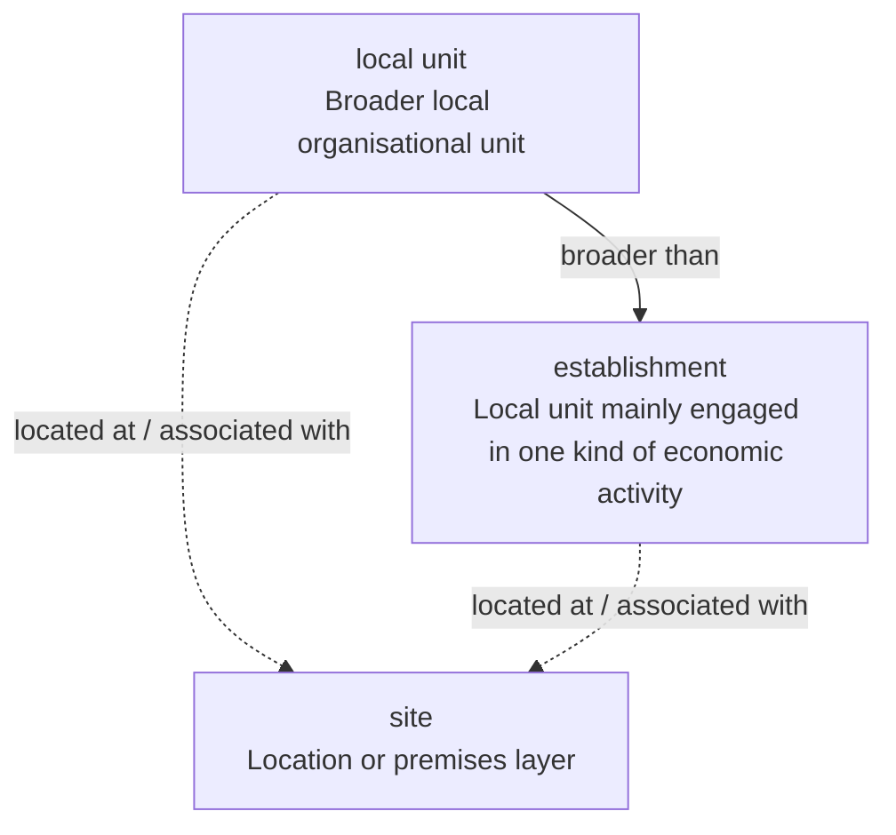

# Relationship between **local unit**, **establishment**, and **site**

This note explains how the three WE BUILD Terminology concepts relate to one another and how they should be used consistently in semantic modelling, documentation, and implementation work.

## Summary

The three concepts do **not** describe the same thing.

- **site** describes the **location or premises layer**
- **local unit** describes the **organisation’s local operating unit**
- **establishment** describes a **more specific kind of local unit**, namely a production-oriented local unit mainly engaged in one kind of economic activity

Accordingly:

- **local unit** is **broader** than **establishment**
- both **local unit** and **establishment** are conceptually **relative to a site**
- **site** should not be used when the intended meaning is the organisational or statistical sub-unit itself

---

## 1. Concept: site

**URI**  
`https://iri.suomi.fi/terminology/webuild/site`

**Preferred term**  
site

**Synonyms**  
- location of operation
- premises

**Definition**  
A place, premises or location at which an organisation is present or located.

**Usage note**  
Use only for the **location or premises layer**. Do not use for the enterprise (economic operator) sub-unit itself when the intended meaning is a local operating or statistical unit.

### Interpretation

`site` is the most spatial of the three concepts. It answers questions such as:

- Where is the organisation present?
- At which premises does activity take place?
- Which location is being referred to?

It does **not** by itself denote the organisational unit operating there.

---

## 2. Concept: local unit

**Interpretation in this relationship model**  
`local unit` is the broader organisational concept for a locally situated sub-unit of an organisation.

### Interpretation

`local unit` should be used when the intended meaning is the organisation’s local operating presence or local sub-unit, rather than merely the place where it is located.

A `local unit` is therefore:

- more than a physical location
- an organisationally meaningful local presence
- commonly associated with a particular site

In this model, **local unit is broader than establishment**.

---

## 3. Concept: establishment

**URI**  
`https://iri.suomi.fi/terminology/webuild/establishment`

**Preferred term**  
establishment

**Synonyms**  
- local KAU
- LKAU
- local kind-of-activity unit

**Definition**  
A local unit that constitutes a production unit mainly engaged in one kind of economic activity, corresponding to the local part of a kind-of-activity unit.

**Usage note**  
Use when the concept is not merely a local operating presence but a production-oriented local unit characterised by a principal activity. In Eurostat and related statistical contexts this corresponds to the local kind-of-activity unit.

### Interpretation

`establishment` is a **specialised subtype of local unit**.

It should be used when the local unit is characterised in a more analytically precise way, especially when:

- the unit is relevant as a **production unit**
- a **principal economic activity** is important
- the context follows **Eurostat** or related statistical logic

Thus, every `establishment` is a `local unit`, but not every `local unit` needs to be an `establishment`.

---

## 4. Relationship between the three concepts

The cleanest interpretation is a **two-layer model**:

### Layer 1: location layer
- **site** = the place, premises, or location

### Layer 2: organisational/statistical unit layer
- **local unit** = the broader local organisational unit
- **establishment** = a narrower, activity-based subtype of local unit

This means that `site` and `local unit` are **not** in a simple broader/narrower relation, because they belong to different conceptual layers:

- `site` is about **where**
- `local unit` and `establishment` are about **what kind of unit** exists there

A practical way to describe the relationship is therefore:

- a **local unit** is **located at** or **associated with** a **site**
- an **establishment** is **located at** or **associated with** a **site**
- an **establishment** is a **narrower concept than local unit**

---

## 5. Recommended usage guidance

### Use **site** when:
- you mean the physical place, premises, or location
- you are modelling addressable or locational presence
- you do **not** mean the organisational sub-unit itself

### Use **local unit** when:
- you mean the organisation’s local operating unit
- you need a broader concept than `establishment`
- the focus is on local organisational presence rather than principal activity analysis

### Use **establishment** when:
- you need the Eurostat-style statistical concept
- the local unit is understood as a production unit
- the principal economic activity is important
- `local KAU` / `LKAU` semantics are intended

---

## 6. Modelling recommendation

For semantic modelling, the following interpretation is recommended:

- model **site** as a distinct concept for the **location layer**
- model **local unit** as the broader **local organisational unit** concept
- model **establishment** as a narrower concept under **local unit**
- connect `local unit` and `establishment` to `site` through a relation such as:
  - `located at`
  - `operates at`
  - `has site`
  - or another vocabulary-specific location relation

This avoids the common category mistake of using `site` as though it were itself the operating or statistical unit.

---

## 7. Mermaid chart

---

## 8. Condensed formulation

A concise formulation suitable for specification work is the following:

> **site** denotes the place or premises where an organisation is present.  
> **local unit** denotes the broader local operating unit of an organisation.  
> **establishment** denotes a narrower type of local unit, namely a production-oriented local unit mainly engaged in one kind of economic activity.  
> Both **local unit** and **establishment** are related to a **site**, but **site** should not be used for the unit itself.

---

## 9. Publication note

This file is intended as a GitHub-ready descriptive note for publication alongside the WE BUILD Terminology material.
